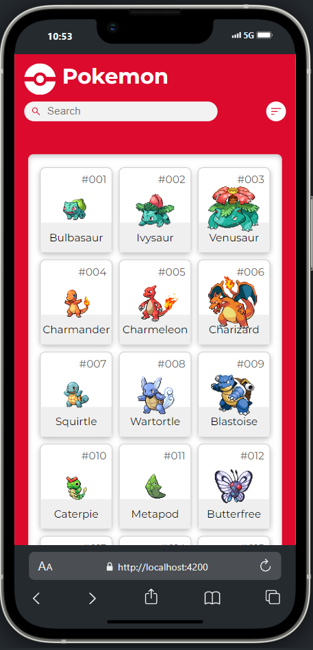
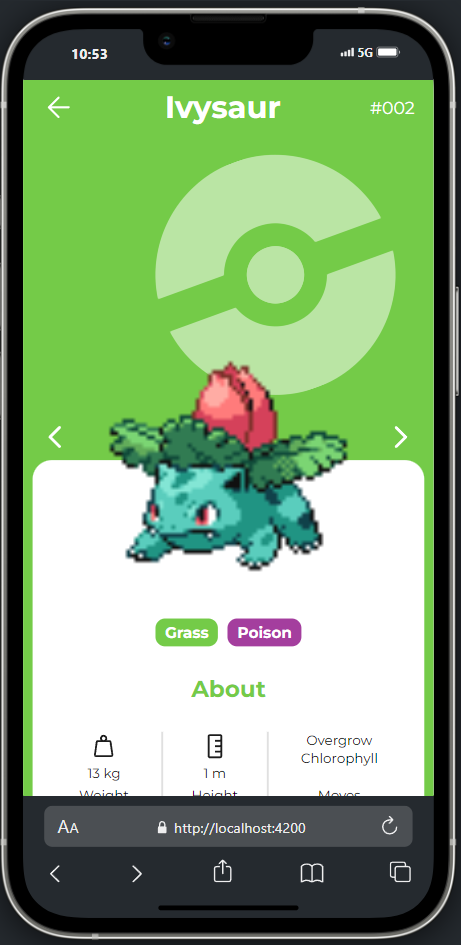
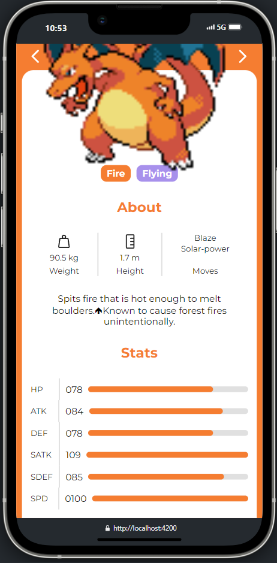

# Pokedex

Ceci est un projet réalisé  dans le cadre de mon apprentissage en Angular. Ce projet est basé sur le [Figma de Ricardo Schiniegoski](https://www.figma.com/design/lwJykPEYFaebhzexARCleh/Pok%C3%A9dex-(Community)?node-id=0-1&node-type=canvas&t=Wmj3DExf86XGXglo-0) et la [PokéApi](https://pokeapi.co/).

## Table of contents

- [Overview](#overview)
  - [The challenge](#the-challenge)
  - [Screenshot](#screenshot)
- [My process](#my-process)
  - [Built with](#built-with)
- [Author](#author)

## Overview

### Le challenge

L'idée était de réaliser un projet simple où l'on récupère de la data sur une API publique.

Basé sur le design trouvé sur Figma Community, j'ai souhaité afficher la liste des pokémons, réaliser une pagination ainsi qu'une page détail des pokémons. 

Etant mon premier projet réalisé en Angular, j'ai pu découvrir certaines fonctionnalités et comprendre le fonctionnement de ce framework.

### Screenshot

## My process

### Built with

- Semantic HTML5 markup
- SCSS
- TypeScript (Angular)
- Flexbox
- Mobile-first workflow

## Author

- Github - [Dylan Feys](https://github.com/HappyFeys)

## Remarque

Il y a un soucis avec la barre de recherche, il faudra que je m'y repenche dessus. La PokéApi n'a pas de endpoint pour faire des recherches dynamiques. J'avais commencé à le faire côté client, mais par manque de temps, je préfère passer à autre chose pour vraiment voir un maximum pour mon stage. 
Le tri n'est également pas fait, mais je ne trouvais pas cela cohérent, le bouton est là pour décorer.
Au niveau du ressenti, chouette premier projet... Hâte de retourner dessus.